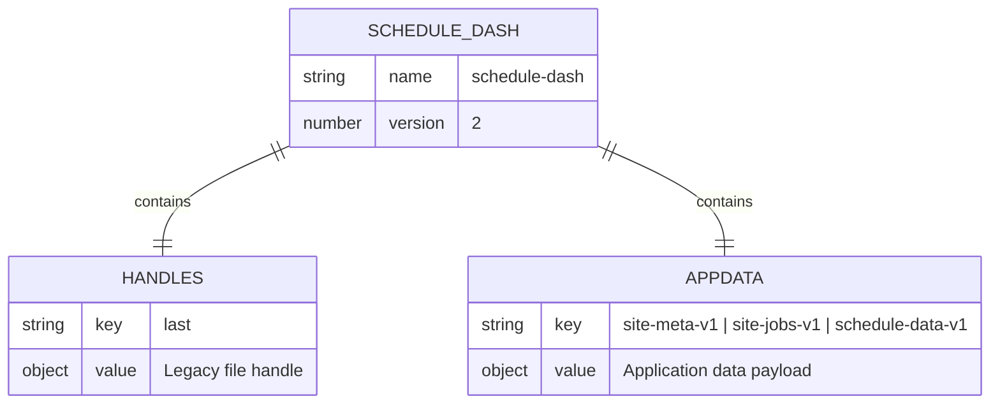
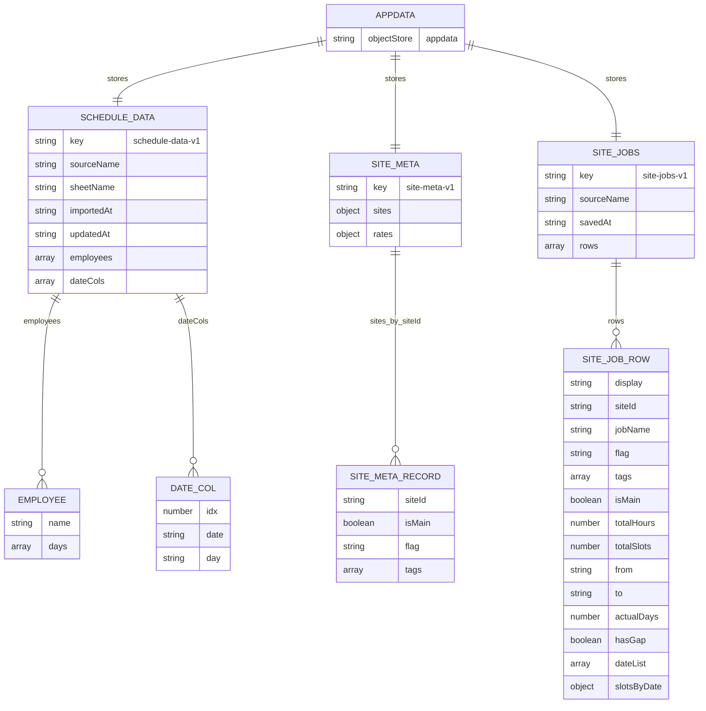
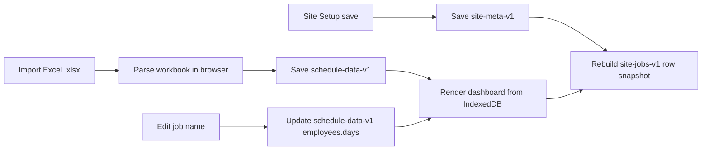

# IndexedDB Diagram

The app uses IndexedDB database `schedule-dash` at version `2`.

Excel is import-only. After import, the schedule, Site Setup metadata, Sites & Jobs row snapshot, and job-name edits are saved in IndexedDB.

## Stores



## `appdata` Keys



## Flag And Tag Storage

Flags and tags are saved in `appdata -> site-meta-v1`.

```json
{
  "sites": {
    "E07": {
      "isMain": true,
      "flag": "macro",
      "tags": ["priority", "night shift"]
    }
  },
  "rates": {
    "macro": 125,
    "ibc": 0,
    "tx": 0,
    "tunnel": 0,
    "core": 0
  }
}
```

The Sites & Jobs snapshot in `appdata -> site-jobs-v1` also includes `flag` and `tags` on each row. That snapshot is derived from `schedule-data-v1` plus `site-meta-v1`, so `site-meta-v1` is the source of truth for Site Setup values.

## Data Flow



## Source Of Truth

- `schedule-data-v1` is the source of truth for imported employee/day schedule cells.
- `site-meta-v1` is the source of truth for site setup fields: `isMain`, `flag`, `tags`, and flag `rates`.
- `site-jobs-v1` is a denormalized snapshot for row-style Sites & Jobs data, including copied `flag`, `tags`, and `totalHours`.
- `handles` is legacy file-handle storage and is no longer used for the full IndexedDB workflow.
