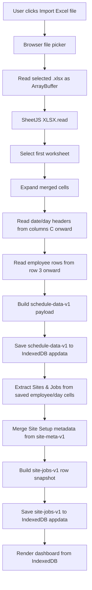
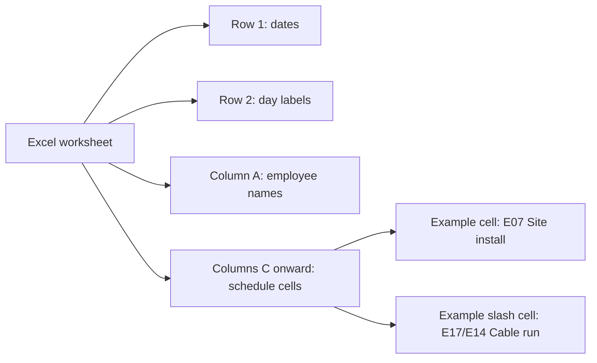
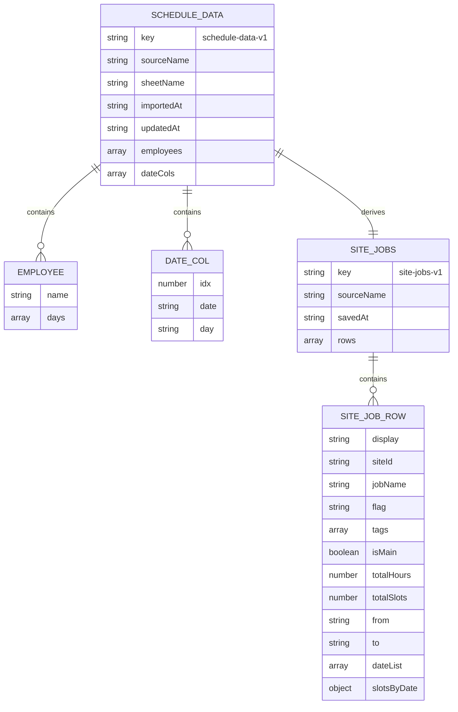

# Excel Conversion To IndexedDB Diagram

This diagram shows how an imported `.xlsx` file becomes IndexedDB data. The Excel file is only read during import. After conversion, the app renders and edits the IndexedDB dataset.

## Conversion Flow

## Imported Excel Shape

## IndexedDB Output

## Conversion Details

1. `importExcelFile()` opens the browser file picker and reads the selected workbook as an `ArrayBuffer`.
2. `parseWorkbookToDataset()` parses the first worksheet with SheetJS.
3. Merged cells are expanded so every merged schedule cell has the origin value.
4. Date columns are read from Excel column C onward.
5. Employee rows are read from Excel row 3 onward.
6. The imported schedule is saved as `schedule-data-v1` in IndexedDB.
7. `extractSites()` derives Sites & Jobs rows from the saved employee/day cells.
8. `getSiteMeta()` adds saved Site Setup values from `site-meta-v1`, including `flag`, `tags`, and `isMain`.
9. `persistCurrentSiteJobs()` saves the denormalized row snapshot as `site-jobs-v1`.
10. The dashboard renders from the IndexedDB dataset, not from the Excel file.

## Key Rule

After import, edits update IndexedDB only:

